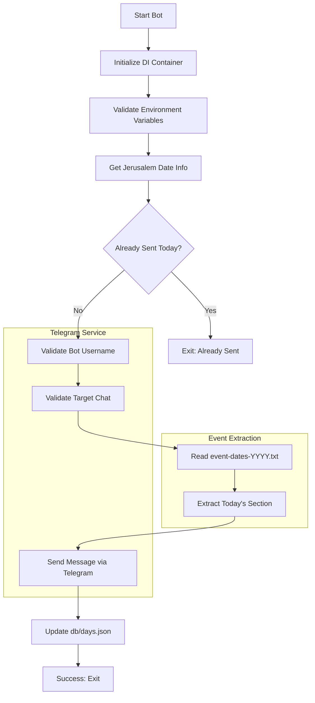

# daily-events-bot

Automated scheduler script that compiles your daily tasks, holidays, birthdays, anniversaries, memorial dates, service expirations, and routine activities, then sends them via a Telegram bot to a chat, triggering mobile notifications that help you stay organized, consistent, and always on track.

Built to streamline personal organization, this Node.js application reads event data from local text files, validates the current date against a local database to prevent duplicate notifications, and communicates directly with the Telegram Bot API.

## Features

- � **Automated Daily Scheduling**: Fetches events for the current day automatically.
- 🤖 **Telegram Integration**: Sends formatted event lists directly to a specified Telegram chat.
- � **Jerusalem Timezone Support**: Specifically designed to operate on Jerusalem time with Hebrew day name support.
- 🗄️ **Local JSON Database**: Tracks sent notifications to ensure each day's events are only sent once.
- 💉 **Dependency Injection**: Built with InversifyJS for a clean, modular, and testable architecture.
- � **Flexible Event Parsing**: Reads events from yearly text files with a simple, readable format.
- �️ **Validation Logic**: Validates both the bot's credentials and the target chat before sending messages.
- � **Comprehensive Testing**: Includes unit tests for core services and utilities using Vitest.

## Getting Started

### Prerequisites

- Node.js (v18 or higher recommended)
- pnpm (or npm/yarn)
- A Telegram Bot Token (from @BotFather)
- A Target Telegram Chat ID

### Installation

1. Clone the repository:

```bash
git clone https://github.com/orassayag/daily-events-bot.git
cd daily-events-bot
```

2. Install dependencies:

```bash
pnpm install
```

3. Create a `.env` file based on `.env.example` and fill in your credentials:

```env
BOT_USERNAME=YourBotUsername
TARGET_USERNAME=YourTargetChatTitleOrUsername
TOKEN=your_telegram_bot_token
CHAT_ID=your_target_chat_id
```

### Quick Start

1. Ensure your event files are in the directory specified in `src/settings/settings.ts`.
2. Run the bot:

```bash
pnpm start
```

## Configuration

Edit `src/settings/settings.ts` to configure file paths:

- `dailyFolderPath`: The directory where your `event-dates-YYYY.txt` files are stored.
- `dbPath`: The path to the `days.json` file used for tracking sent dates.

Environment variables in `.env`:

- `BOT_USERNAME`: The username of your Telegram bot.
- `TARGET_USERNAME`: The title or username of the chat where messages will be sent.
- `TOKEN`: Your Telegram Bot API token.
- `CHAT_ID`: The unique identifier for the target chat.

## Available Scripts

- `pnpm start`: Runs the bot once.
- `pnpm dev`: Runs the bot in watch mode for development.
- `pnpm test`: Runs the test suite using Vitest.
- `pnpm build`: Compiles TypeScript to JavaScript.
- `pnpm lint`: Runs ESLint to check for code quality.
- `pnpm format`: Formats the code using Prettier.

## Project Structure

```
daily-events-bot/
├── db/                   # Local database storage
│   └── days.json         # Tracks sent notification dates
├── src/
│   ├── di/               # Dependency Injection configuration
│   ├── services/         # Core business logic (Telegram, File, Database)
│   ├── settings/         # Application settings and paths
│   ├── types/            # TypeScript type definitions
│   ├── utils/            # Utility functions (Date formatting)
│   ├── bot.ts            # Main bot orchestration logic
│   └── index.ts          # Entry point
├── src/__tests__/        # Unit tests
├── .env                  # Environment variables (private)
├── package.json          # Project configuration and dependencies
└── tsconfig.json         # TypeScript configuration
```

## How It Works



## Architecture Flow

1. **Entry Point**: `index.ts` resolves the `DailyEventsBot` from the DI container.
2. **Orchestration**: `DailyEventsBot.run()` manages the sequential flow of operations.
3. **Date Management**: `DateUtils` provides localized date info (Jerusalem time).
4. **Persistence**: `DatabaseService` handles reading/writing to `days.json`.
5. **Messaging**: `TelegramService` interacts with the Telegram Bot API.
6. **Data Retrieval**: `EventFileService` parses the raw text files for daily content.

## Email Validation Features

While this bot does not perform email validation, it implements strict **Event Data Validation**:

- **Date Matching**: Ensures events are only fetched for the exact current date.
- **Section Parsing**: Identifies the start and end of daily event sections using separators like `===` or `###`.
- **Format Integrity**: Validates that the event file exists and follows the expected yearly naming convention.
- **Duplicate Prevention**: Cross-references with the local database to avoid spamming the chat.

## Console Status Example

```
===Daily Events Bot Started===
Date: 04/05/2026
1. Checking if message for today already sent
2. Validating bot and chat
3. Fetching events from file
4. Sending message
5. Marking date as sent
===Success: Message sent===
```

## Output Files

- `db/days.json`: Stores a record of all dates for which a notification has been successfully sent.
- `logs/`: Execution details and errors are logged to the console.

## Development

- **Testing**: Run `pnpm test` to execute unit tests. The project uses Vitest for fast, reliable testing.
- **Mocking**: Services are designed to be easily mockable for testing purposes.
- **Formatting**: Ensure code quality by running `pnpm format` before contributing.

## Contributing

Contributions are welcome! Please follow the guidelines in `CONTRIBUTING.md`.

1. Fork the repository.
2. Create a new branch for your feature or bugfix.
3. Ensure all tests pass.
4. Submit a pull request.

## Built With

- [Node.js](https://nodejs.org/) - JavaScript runtime
- [TypeScript](https://www.typescriptlang.org/) - Typed superset of JavaScript
- [InversifyJS](https://inversify.io/) - Powerful and lightweight IoC container
- [Vitest](https://vitest.dev/) - Next generation testing framework
- [Telegram Bot API](https://core.telegram.org/bots/api) - For sending notifications

## License

This application has an MIT license - see the [LICENSE](LICENSE) file for details.

## Author

- **Or Assayag** - _Initial work_ - [orassayag](https://github.com/orassayag)
- Or Assayag <orassayag@gmail.com>
- GitHub: https://github.com/orassayag
- StackOverflow: https://stackoverflow.com/users/4442606/or-assayag?tab=profile
- LinkedIn: https://linkedin.com/in/orassayag

## Acknowledgments

- Built for educational and research purposes
- Respects robots.txt and implements rate limiting
- Uses user-agent rotation to avoid detection
- Implements polite crawling practices
## License

This project is licensed under the MIT License - see the [LICENSE](LICENSE) file for details.
